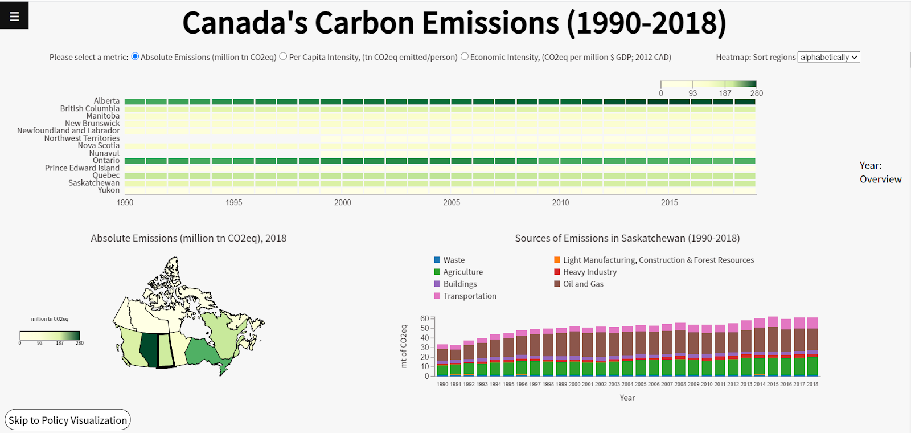

# Carbon Emissions Canada
436V Final Project 2020WT2

Instructor: Tamara Munzner

## Contributors 
- Florentina Simlinger
- Edward Le
- Melissa Bernstein

## Screenshot

## File Structure Description
The code is structured along two paths, representing our two visualizations (`historical` and `policy`).
Each visualization will have its own `main.js` controlling their behvaviours).

Data is stored in the data folder (along `historical` and `policy` lines).
The javascript files follow a similar correspondence between `historical` and `policy`.

The historical visualization is composed of a heatmap (`heatmap.js`), a choropleth (`choropleth.js`),
and a stacked bar chart (`stackedBarChart.js`). There are coordinated interactions between all three plots.

The policy visualization is composed of a stacked bachart (`timeline.js`)

#File Structure
- assets: photos including `thumbnail.png`
- css: styling
- data
    - historical
    - policy
- js
    - historical
        - choropleth map
        - heatmap
        - main.js
        - stacked bar chart
    - policy
        - main.js
        - timeline (stacked bar chart)
- index.js
- other js files
- index.html
- README.md

