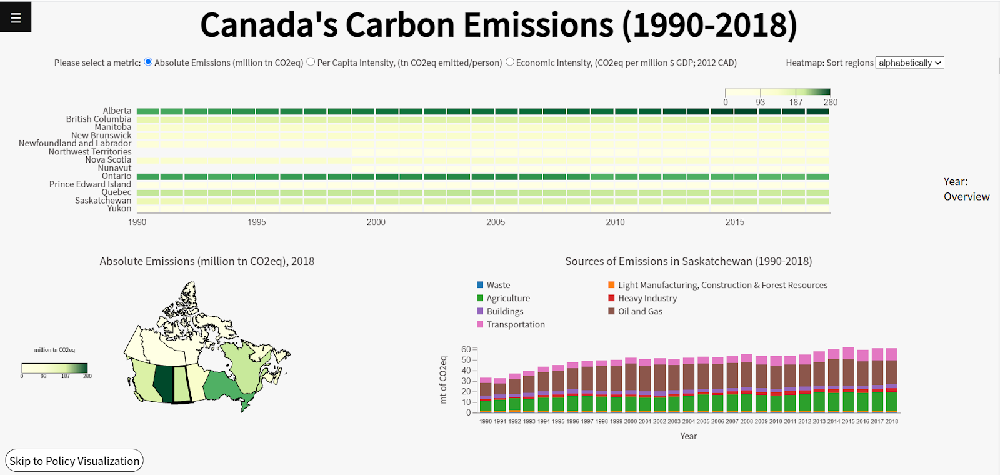

# Carbon Emissions Canada
436V Final Project 2020WT2

Instructor: Tamara Munzner

## Contributors 
- Florentina Simlinger
- Edward Le
- Melissa Bernstein

## Screenshot

## Structure
- assets: photos
- css: styling
- data
    - historical
    - policy
- js
    - historical
        - choropleth map
        - heatmap
        - main.js
        - stacked bar chart
    - policy
        - main.js
        - timeline (stacked bar chart)
- index.js
- other js files
- index.html
- README.md

